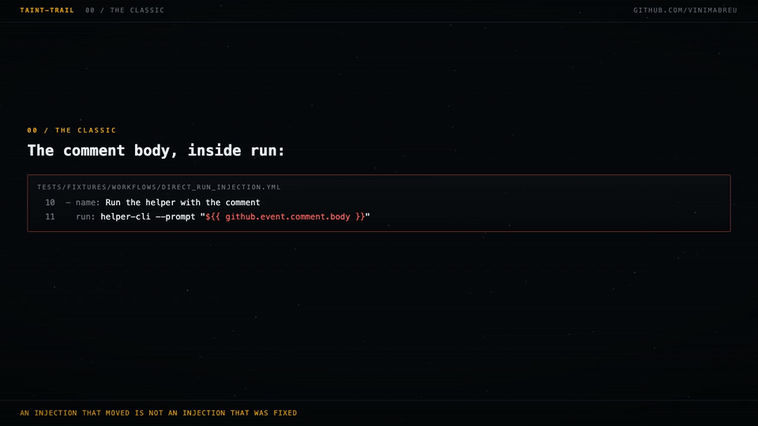
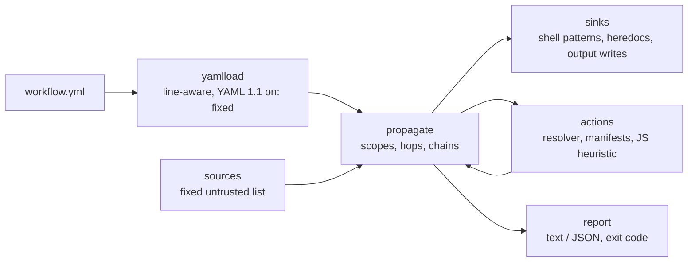

# taint-trail

[](https://github.com/vinimabreu/taint-trail/actions/workflows/ci.yml)


**An injection that moved is not an injection that was fixed.**

The usual fix for `${{ github.event.comment.body }}` inside a `run:` block is to move the value into `env:`. That removes the template from the script, and it removes the finding from every scanner that looks for templates in scripts. It does not remove the value from the job. The variable is still there for a later line to `eval`, for a composite action to forward through `with:`, for a shell script to hand to a Node wrapper. Whether the injection is gone depends entirely on what happens after the move.

`taint-trail` follows the value after the move. It is a deterministic static analyser for GitHub Actions workflows: it starts at every untrusted expression, follows it through `env:`, `with:`, step outputs, job outputs and into the called action, recursively, and ends each chain with one of five verdicts. The value reached a shell (`SHELL`), it can spoof `$GITHUB_OUTPUT` (`SPOOF`), a JavaScript action looks like it builds a command string (`SUSPECT`), it died as a discrete argument with no shell in between (`DIES`), or the tool could not follow and says exactly where it stopped and why (`UNKNOWN`).

One runtime dependency (PyYAML). No network, no model, no key. The suite runs offline against vendored fixtures.



Every line of tool output in that animation is a verbatim capture: `python examples/hero_chain.py` for the trail, and the two fixtures it names under `tests/fixtures/workflows/` for the classic and the moved-not-fixed cases.

## What zizmor does, and what this does

Run [zizmor](https://github.com/zizmorcore/zizmor) first. It audits a workflow for a long list of problems (template injection, dangerous triggers, unpinned actions, cache poisoning, permissions and more), it is fast and well maintained, and this project does not repeat that work. The expression inside `run:` is zizmor's territory. This tool keeps that one check for completeness, so the "before" of every fix is still detected, and spends the rest of its effort on what happens to the value after it leaves the expression.

| The value... | verdict |
|---|---|
| is interpolated straight into `run:` | `SHELL` (the classic injection) |
| moves to `env:` and the script does `eval "$VAR"`, `bash -c`, `source`, `xargs`, `\| sh` | `SHELL` (moved, not fixed) |
| moves to `env:` and the script only does `echo "$VAR"` or `tool --flag "$VAR"` | `DIES` (a value, not syntax) |
| is written to `$GITHUB_OUTPUT` on one line, under a static heredoc delimiter, or with `::set-output` | `SPOOF` |
| goes through `with:` into a composite action, a script, then a Node wrapper with an argv array | `DIES (heuristic)` |
| goes into a JavaScript action | `SUSPECT`, `DIES` or `UNKNOWN`, always labelled `heuristic`; its outputs are treated as tainted |
| goes into a docker action, or an action that is not vendored locally | `UNKNOWN`, with the reason |

## The chain, in ten seconds

The fixture is an `issue_comment` workflow that once interpolated the comment body into `run:`. The fix moved it into `env:`, passed it through `with:` into a composite action, which put it in `env:` again for a shell script that only delegates to a Node wrapper, which passes it as one element of a `spawn()` argv array. The shape is modelled on a real finding currently in coordinated disclosure; the names, files and trigger word here are invented.

<!-- hero:start -->
```text
github.event.comment.body  [untrusted]  tests/fixtures/workflows/moved_and_died.yml / job helper
  tests/fixtures/workflows/moved_and_died.yml:13  env BODY
  tests/fixtures/workflows/moved_and_died.yml:16  with prompt  (env.BODY -> example/helper-action@v1)
  tests/fixtures/actions/example/helper-action/v1/action.yml:4  inputs.prompt
  tests/fixtures/actions/example/helper-action/v1/action.yml:19  env HELPER_PROMPT  (inputs.prompt)
  tests/fixtures/actions/example/helper-action/v1/action.yml:21  run  (bash "$GITHUB_ACTION_PATH/scripts/run-helper.sh")
  tests/fixtures/actions/example/helper-action/v1/scripts/run-helper.sh:4  script run-helper.sh  (exec node "$DIR/../dist/index.js")
  tests/fixtures/actions/example/helper-action/v1/dist/index.js:4  process.env.HELPER_PROMPT
  DIES (heuristic): argv array via spawn( at tests/fixtures/actions/example/helper-action/v1/dist/index.js:7; no shell: true, no exec(, no execSync(

1 chain(s): SHELL 0  SPOOF 0  SUSPECT 0  DIES 1  UNKNOWN 0
```
<!-- hero:end -->

Seven hops, then the verdict, with the word `heuristic` on it because the last file is JavaScript and JavaScript is matched by pattern, not parsed. Change the wrapper's `spawn("helper-cli", [..., prompt])` to `execSync(` with a template literal and the same chain ends in `SUSPECT (heuristic)`. Delete the composite action from the local directory and it ends in `UNKNOWN: action example/helper-action@v1 not available locally (...)`, because the tool does not guess what an action it cannot read does.

That output is `python examples/hero_chain.py`, offline, from the fixtures in this repository. The test suite compares the block above with the demo output byte for byte.

## Verdicts

- `SHELL`: the value is re-parsed as code. Either the expression was expanded into the script before it ran, or a tainted variable reached `eval`, `bash -c`, `sh -c`, `source`, `. `, `xargs`, `| sh`, `| bash`, the command position of a line (including after `env FOO=1`, an inline assignment, `nohup`, `time`, `!`, `if`/`while` or a pipe), an interpreter's program string (`python -c`, `python3 -c`, `node -e`, `ruby -e`, `perl -e`, `bun -e`, `php -r`, `deno eval`), an interpreter's standard input through a pipe or a heredoc (`| python3`, `| node -`, `| php`, `| deno run -`, `python - <<EOF`, with any redirect after python, node, ruby, perl, php or bun, a short or long flag written as one word, `-W`, `-X` or `-r` with their argument, or a further pipe stage after the interpreter, as in `| node --input-type=module` and `| python3 | tee log`; an interpreter given a script file is not counted), a process substitution given to a shell or interpreter (`bash <(echo "$V")`), or a `github-script` block. The shell or interpreter is matched by its basename, so a full path (`/bin/bash -c`), an `env` wrapper (`/usr/bin/env bash -c`) and `sudo` all count; `|&` is a pipe like `|`. Exit 1.
- `SPOOF`: the value is written to `$GITHUB_OUTPUT` or `$GITHUB_ENV` in a way that lets it add keys. One-line `echo "k=$V" >> "$GITHUB_OUTPUT"` (a newline in the value starts a new key), a heredoc block whose delimiter is a fixed word like `EOF` (a value containing that word closes the block early), or the deprecated `::set-output name=k::$V` command, which the runner still honours. The block is recognised whether it spans several lines, sits inside a `{ ...; }` or `( ...; )` group in any layout (one line, opening with content, closing on the last body line, nested, after `&&`, inside `if`, `for` or `while`, with a `case` pattern inside a subshell, or closing with a `\`, `|` or `&&` continuation on the closing line), sits inside a `for`/`while`/`until`/`if` block spanning more than one line whose `done`/`fi` line carries the redirect (an arithmetic `for ((...))` or `(( ))` condition included), or is written by three separate `echo` lines. The target is any redirect or tee form (`>>`, `>`, `1>>`, `2>>`, `&>>`, `&>`, `>|`, `2>&1 >>`, `| tee -a`, `| tee --append`, `| sudo tee -a`), a variable assigned the file's path (`OUT="$GITHUB_OUTPUT"` then `>> "$OUT"`), or a descriptor opened on it (`exec 3>>"$GITHUB_OUTPUT"` then `>&3`). A delimiter built from `openssl rand`, `$RANDOM`, `uuidgen`, `/dev/urandom` or `mktemp` is accepted; `$$`, `head -c` on a file or a clock is not proven random and the write ends as `UNKNOWN`. Exit 1.
- `SUSPECT (heuristic)`: a JavaScript action or script contains `shell: true`, `execSync(`, or `exec(` with a template literal that interpolates the input. No JavaScript is parsed; this is a pattern match and says so.
- `DIES`: the value ended as a value. Quoted or unquoted expansion into an argument, `echo`, a write to `$GITHUB_OUTPUT` under a random heredoc delimiter, an argv array in `spawn`/`execFile` (labelled `heuristic` when the evidence is JavaScript), a value piped only into a fixed single-quoted program that reads standard input (`echo "$V" | perl -pe 's/x//'`, `| python3 -c '...sys.stdin...'`, the sanitiser idiom), or an environment variable that nothing in scope reads by name.
- `UNKNOWN: <reason>`: the tool stopped and refuses to guess. The reason is always concrete: the action is not available locally, it is a docker action, the JavaScript matched no pattern, `exec(` could not be tied to the input, a script could not be located, a delimiter could not be proven random, a program string (`python -c`, `bash -c`, `php -r`, `deno eval`, the input of `envsubst`) names the variable without the outer shell expanding it (also when the value was piped into that program from the left, on a line that does not open a heredoc), the value went into `$GITHUB_ENV` under a random delimiter and later steps are not tracked, the step's shell is `pwsh`, `python` or `cmd`, `runs-on` is an expression that may select a Windows runner, a file the tool would open resolves outside its root, the depth limit was reached, or a cycle was found.

Exit code is 1 when any chain from an untrusted source ends in `SHELL` or `SPOOF`, 0 otherwise. `--strict` also exits 1 on `SUSPECT` and `UNKNOWN`. Usage errors exit 2. A file that cannot be read or parsed (not UTF-8, not YAML, not a mapping, nested beyond what the parser handles) is reported on stderr and skipped; the exit code is 2 only when no file at all could be read, otherwise it follows the verdicts of the files that were. `github.event.inputs.*` and a top-level `inputs.*` (workflow_dispatch) are printed with the label `semi-trusted, not counted` and never affect the exit code: only someone who can already dispatch the workflow sets them.

## Sources

The untrusted list is fixed and follows the GitHub documentation on script injection, plus the event fields an outside contributor controls through discussions, `workflow_run` and `repository_dispatch`:

`github.event.issue.{title,body}`, `github.event.pull_request.{title,body,head.ref,head.label,head.repo.default_branch}`, `github.event.comment.body`, `github.event.review.body`, `github.event.review_comment.body`, `github.event.discussion.{title,body}`, `github.event.pages.*.page_name`, `github.event.commits.*.{message,author.name,author.email}`, `github.event.head_commit.{message,author.*}`, `github.head_ref`, `github.event.workflow_run.{head_branch,head_commit.message,head_commit.author.*,display_title}`, `github.event.client_payload.*`.

A reference that is a prefix of one of these (`github.event` inside `toJSON(...)`, `github.event.pull_request`) is tainted too, because it carries the fields inside it. `github.event.pull_request.number`, `github.sha`, `github.actor` and the like are not.

## How propagation works

Every `${{ }}` is resolved in the scope where it appears: `github.*` against the list above, `env.X` against what the workflow, job and step put in `X`, `inputs.X` against the caller's `with:`, `steps.X.outputs.Y` and `needs.J.outputs.Y` against what earlier steps and jobs wrote, `matrix.*` against a matrix that holds an expression anywhere (the whole `matrix:`, one axis, or `include:`). Each carrier adds a hop with the file and line where the value changed hands.

- `env:` at workflow, job or step level: the variable is tainted for every shell in scope, including the steps of a composite action the job calls (a composite step inherits the process environment).
- `with:` on a `uses:` step: the action's input is tainted; the action is resolved and its steps go through the same analysis, depth 5 by default, with cycle detection.
- A composite action's `outputs:` and a reusable workflow's `outputs:` carry taint back to the caller. Reusable workflows are followed one level.
- A `run:` step whose environment holds a tainted variable and whose script writes to `$GITHUB_OUTPUT` or `$GITHUB_ENV` (or uses `::set-output`) taints **every** output of that step, whatever its `shell:`. A `pwsh` step writing `$env:GITHUB_OUTPUT` or a `python` step opening `os.environ["GITHUB_OUTPUT"]` is matched by the file's name (the step itself stays `UNKNOWN`, its outputs do not). This is a documented over-approximation: the runner parses that file as `key=value` lines and the tool does not try to prove which keys the script wrote. The same rule fires when the write happens in a followed script, shell or JavaScript (`$GITHUB_OUTPUT`, `core.setOutput`, `exportVariable`), and when the expression itself is expanded into a script that writes the file.
- A JavaScript action that received a tainted `with:` input, or reads a tainted variable through `process.env`, taints every output it declares and every other name as well, because `core.setOutput` can set an output the manifest never declares. `github-script` taints its `result` and every `setOutput` the same way. Nothing inside the JavaScript is followed to prove which output got the value; the hop says `over-approximation`.
- A script invoked from `run:` by path (`bash x.sh`, `./x.sh`, `"$GITHUB_ACTION_PATH/x.sh"`, `node x.js`, the `$(dirname "$0")` idiom) is read and analysed with the same rules. Tainted arguments become `$1`, `$2`, `"$@"` inside it; `TMP="$1"` taints `TMP` from that line on.
- A tainted variable that nothing in scope reads by name ends the chain as `DIES` (never read). If an action the tool could not read ran with that variable in its environment, it ends as `UNKNOWN` naming the action instead.

Shell text is matched line by line with quotes and comments understood: single-quoted `'$VAR'` is not a reference, a heredoc body expands even inside single quotes, `<<'EOF'` expands nothing, and `key<<DELIM` lines written to the output file are tracked as a block until the matching `DELIM` line.

## Limits, stated plainly

- **Bash is matched by pattern, not parsed.** `bash -c 'tool "$1"' _ "$VAR"` is safe and is reported as `SHELL` anyway, because the tool sees `bash -c` and the variable on the same line. Sanitised expansions such as `${VAR//$'\n'/}` before a write to `$GITHUB_OUTPUT` are still `SPOOF`. Read the line the chain points at.
- **JavaScript is a heuristic**, and every verdict from it says so. There is no dataflow analysis. A bundled action whose `getInput('x')` string survived bundling is matched; one that renamed it is `UNKNOWN`. A regex `.exec(` can match the `exec(` pattern.
- **Docker actions are opaque.** The arguments reach an entrypoint the tool does not read.
- **Reusable workflows are followed one level.** A reusable workflow calling another is `UNKNOWN`.
- **Secrets are trusted by definition.** `${{ secrets.X }}` is never a source.
- **Permissions, pinning and trigger hygiene are zizmor's job**, not this tool's.
- Variables set through `$GITHUB_ENV` are not tracked into later steps. A random-delimiter write to `$GITHUB_ENV` therefore ends as `UNKNOWN`, not `DIES`; the single-line and static-delimiter forms are `SPOOF` regardless. `$GITHUB_PATH` is ignored.
- Environment inheritance into JavaScript is followed only when the file names the variable: `process.env.X`, `process.env["X"]`, destructuring, or an alias such as `const env = process.env` followed by `env.X`. Environment inheritance into docker actions and into binaries is not followed.
- Steps whose shell is `pwsh`, `powershell`, `python` or `cmd` are `UNKNOWN` when they mention a tainted variable; their outputs are still tainted when the script names the runner file. The shell is the step's own `shell:` (a full path such as `/bin/bash -e {0}` counts by its name), else the job's or the workflow's `defaults.run.shell`, else `pwsh` when `runs-on` names a `windows-*` label as a string, in a list, or in the `labels` of a `group` mapping. A `runs-on` that is an expression is resolved against the job's matrix: when every value the key can take (axis, `include`, `exclude`) is a non-Windows label, the job is analysed as bash; when any value is Windows, the matrix is itself an expression, the key does not exist, or the expression is not `matrix.*`, the default shell is undetermined and a tainted mention is `UNKNOWN` saying so. A `self-hosted` runner with no OS label (`runs-on: [self-hosted]`) is likewise undetermined, because it can be any platform; `self-hosted` alongside a `linux`, `ubuntu` or `macos` label is analysed as bash.
- **Shell shapes not matched**, reported as `DIES` or not at all: command substitution in command position (`$(echo "$V") --flag`, backticks), `set -- $V` followed by `"$@"`, `awk` with `system()`, and `eval` or a shell reached through a variable (`CMD=eval; $CMD "$V"`, `$SHELL -c "$V"`, `"$(command -v bash)" -c "$V"`). The fixtures `tests/fixtures/workflows/gap_*.yml` pin these and the eleven shapes below as known gaps, so adding a pattern means removing a line here.
- A `for`/`while`/`until`/`if` block written on one line with its redirect (`for k in a b; do echo "k=$V"; done >> "$GITHUB_OUTPUT"`) is not tracked as a block; only the form spanning more than one line is.
- A `case ... esac >> "$GITHUB_OUTPUT"` block is not tracked: the redirect on `esac` is not carried into the pattern bodies.
- A `done` or `fi` whose redirect sits on a continuation line (`done \` then `>> "$GITHUB_OUTPUT"`) is not tracked; a continuation on the closing line is joined only for `{ }` and `( )` groups.
- A here-string is not a sink: `bash <<< "$V"`, `sh -s <<< "$V"` and `python3 - <<< "$V"` are reported as a value use.
- Sibling spellings of a program-string flag are not matched: `perl -E`, `node -p`, `node --eval`, `node --print`, `bun --eval` and a combined `bash -ce` are reported as a value use; only the spellings listed under `SHELL` count.
- A wrapper with an option between it and the value in command position is not matched: `sudo -E "$V"`, `timeout 30 "$V"`, `nice "$V"` and `env -i "$V"` are reported as a value use, while `sudo "$V"`, `env FOO=1 "$V"` and `exec "$V"` are `SHELL`.
- `| env -S bash`, `| busybox sh` and `su -c "$V"` are not matched as shells: `env` counts as a wrapper only without options, and `busybox` and `su` are not on the list.
- `| deno` with nothing after it and `| bun -` are not matched as interpreters reading standard input; `| deno run -` is.
- A redirect after `deno run -` (`| deno run - 2>&1`, `| deno run - > out.txt`) is not matched; the same redirect after `python3 -`, `node -` or `php` is.
- A program string that names the variable on a line that also opens a heredoc (`cat <<EOF | python3 -c '...os.environ["V"]...'`) is not matched by name; the heredoc body itself is still followed.
- An interpreter flag whose argument is a separate word (`node --require ts-node/register`, `php -d display_errors=1`; `-W`, `-X` and `-r` excepted), a flag ending in a digit (`ruby -W0`, `python3 -O2`) or a bare `--` before standard input is reported as a value use; the one-word form (`--require=ts-node/register`) is matched.
- **The only untrusted source is a `${{ }}` expression.** A value read inside `github-script` through `context.payload.*`, or in a shell with `jq` on `$GITHUB_EVENT_PATH`, starts no chain.
- Line numbers inside folded (`>`) scalars and multi-line quoted strings are approximate; block (`|`) scalars and plain scalars are exact.

## Install and usage

```bash
pip install -e ".[dev]"      # or: pip install .
taint-trail .github/workflows
taint-trail path/to/workflow.yml --actions-dir ./vendored-actions --json
taint-trail . --strict --max-depth 3
```

A directory argument scans `<dir>/.github/workflows/*.yml` when that folder exists, otherwise the `*.yml` and `*.yaml` files directly inside it.

Actions are read from a local directory laid out as `owner/repo/ref/action.yml` (a sub-directory action lives at `owner/repo/ref/sub/dir/action.yml`), given with `--actions-dir` or the `TAINT_TRAIL_ACTIONS` environment variable. `./path` references resolve inside the scanned repository. Nothing is ever downloaded unless you pass `--fetch`, which runs `git init`, `git fetch --depth 1 origin -- <ref>` and `git checkout FETCH_HEAD` for every missing `owner/repo@ref` into that directory, once, and then scans. Every `uses:` reference is validated first: owner, repo, path and ref may not contain `..`, owner, repo and ref may not start with `-`, the ref may not start with `/`, and nothing is created or run for a destination that does not resolve under the directory, symlinks included. The test suite never uses `--fetch`.

What is guaranteed about files, exactly: every file the tool opens is checked against a root first, after resolving symlinks. An action's `action.yml` must resolve inside its action directory; `runs.main` must resolve inside the action directory; a script followed from `run:` must resolve inside the workspace, the invoking script's directory or the action directory, and a literal absolute path is never followed; a `working-directory` must resolve inside the workspace or the step's script is not opened. A file that fails the check is never read, and the chain ends `UNKNOWN` naming it. The workflow files given on the command line are the one thing read as given. Tests create real symlinks for each of these and assert that the content of the file outside never appears in any hop or message.

`--json` prints one object: `files`, `chains` (each with `source`, `trust`, `workflow`, `job`, `hops` as `{file, line, carrier, detail}`, and `verdict` as `{kind, heuristic, reason, text}`), a `summary` with counts per verdict, `strict`, and the `exit_code`.

Docker:

```bash
docker build -t taint-trail .
docker run --rm -v "$PWD:/repo" taint-trail /repo
```

## Architecture



The resolver is injected: the default reads a local directory, the tests use vendored fixtures, and nothing in the analyser opens a socket.

## Tests

`707` tests, offline, in about two seconds. They cover every source in the list, every shell sink, the value uses that must die, the heredoc shapes with static and random delimiters (multi-line, three echoes, and 42 fixture layouts of a group into the runner file), every redirect and tee form as a target, the runner file reached through a variable or a descriptor, the deprecated `::set-output`, step and job output propagation, JavaScript and `github-script` outputs, composite recursion with inputs, defaults and outputs, the cycle and depth limits, the three JavaScript outcomes, docker, reusable workflows, script following with positional arguments, inherited shells and `runs-on` from a matrix or a mapping, non-bash shells that write the runner file, JavaScript outputs the manifest does not declare, `process.env` aliases, `php -r`, `deno eval`, `bun -e` and interpreters fed through a pipe, interpreter strings that name the variable, `uses:` references that try to leave the actions directory, every file the tool opens checked against its root with real symlinks, malformed input (not UTF-8, UTF-16, absurd nesting, empty, a list), the resolver miss path, the `on:` boolean trap, the CLI exit codes and JSON shape, shells and interpreters named by a full path or through `env`/`sudo`, more command positions (`env FOO=1`, `nohup`, `time`, `!`, after a pipe), pipes into an interpreter with a trailing redirect, flag or `-`, the sanitiser idiom that stays a value, a group closing with a continuation, a `case` pattern inside a subshell, a redirected `for`/`while`/`if` block, `|&`, a process substitution given to a shell, a self-hosted runner with no OS label, an interpreter's standard input followed by another pipe stage, a long flag or `-r module` before standard input, an arithmetic `((` in a redirected compound, a program string that names the variable after the value was piped in, the documented gaps (one fixture per listed gap shape, count pinned), and the README block against the demo.

```bash
pytest
ruff check . && mypy
```

CI runs the suite on Python 3.11 through 3.14, runs `taint-trail` on this repository's own workflows with `--strict`, and then on two fixtures it must flag (the classic `run:` injection and the one-line brace group), asserting exit 1 with `SHELL` and `SPOOF` in the output. The second step is what proves the analyser detects; the first alone would pass for a tool that finds nothing.

## License

MIT.

Vinicius Pereira
[vinimabreu.dev](https://vinimabreu.dev) · [github.com/vinimabreu](https://github.com/vinimabreu)
